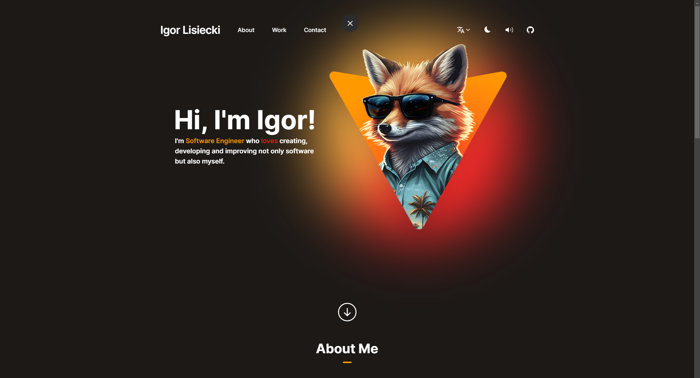

# [Portfolio](https://www.igorlisiecki.pl/)

[](https://www.igorlisiecki.pl/)

## Description

I've created this app for myself as my portfolio website. I've used Next.Js with App Router, Zustand for client side state management and Tailwind. I also used some fancy libraries like next-themes, next-intl, resend, create-email, use-sound, useMediaQuery from usehooks-ts and Framer Motion.
The website is responsive and users have the ability to switch to dark mode, turn off sounds of the website and change the language of it. I tried to maintain good practices like creating reusable components and icons and carefully designing the file structure. The contact form has validation on each field. The website sends a confirmation email to the user and an email to the website owner with the content of the user’s message The emails are built with html elements to look more professional than just plain text.

I plan to continually work on improving this website in the future/ I have a lot of ideas on how to improve this website in the future

## Tech Stack

- [Next.js](https://nextjs.org)
- [Tailwind CSS](https://tailwindcss.com)
- [Zustand](https://zustand-demo.pmnd.rs/)
- [Shadcn/Ui](https://ui.shadcn.com/)
- [React Email](https://react.email/)
- [Resend](https://resend.com/)
- [Next-Intl](https://next-intl-docs.vercel.app/)
- [Framer Motion](https://www.framer.com/motion/)

## Installation

### 1. Clone the repository

```bash
git clone https://github.com/ilisiecki/portfolio-website.git
```

### 2. Install dependencies

```bash
npm install
```

### 3. Create a `.env` file

Create a `.env` file in the root directory and add the environment variables as shown in the `.env.example` file.

### 4. Optional run react-email to see preview of emails templates

```bash
npm run email
```

### 5. Run the application

```bash
npm run dev
```

### 6. View the application

Open [http://localhost:3000](http://localhost:3000) and [http://localhost:3001](http://localhost:3001) if you ran react-email with your browser to see the result.

## Deploy on Vercel

The easiest way to deploy your Next.js app is to use the [Vercel Platform](https://vercel.com/new?utm_medium=default-template&filter=next.js&utm_source=create-next-app&utm_campaign=create-next-app-readme) from the creators of Next.js.

Check out our [Next.js deployment documentation](https://nextjs.org/docs/deployment) for more details.
